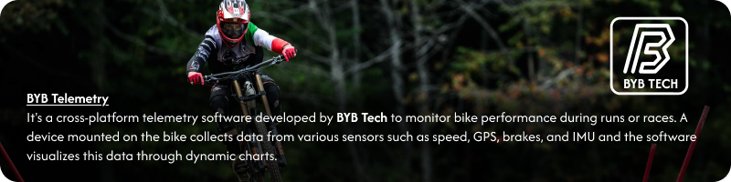
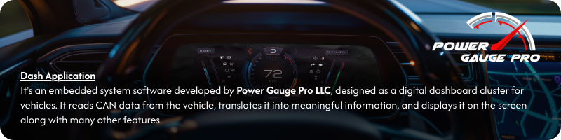
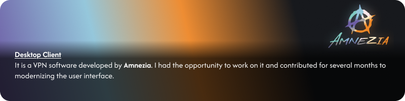
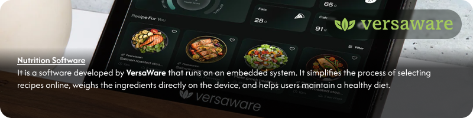
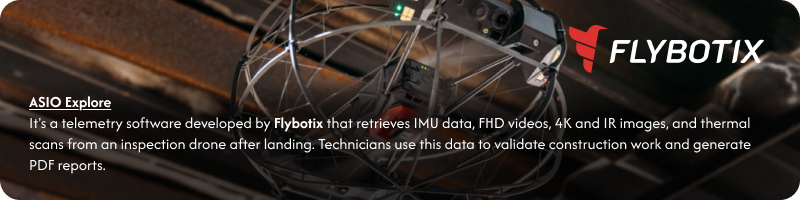

<picture>
  
</picture>

## 👨‍💻 About me:

-   🔭 I’m currently working with <a href="https://www.bybtech.it"> **BYB Tech** </a> as a Freelancer.

-   🌱 I’m currently learning **the communication protocols used by modern vehicles in the Automotive industry.**

-   👯 I’m looking to collaborate on **projects that envolves electronics and wireless communication.**

-   💬 Ask me about **anything related to desktop application developpment.**

## 🌐 Socials:

    

## 💻 Tech Stack:

| Category                   | Tools & Technologies                                                                                                                                                                                                                                                                                                                   |
| -------------------------- | -------------------------------------------------------------------------------------------------------------------------------------------------------------------------------------------------------------------------------------------------------------------------------------------------------------------------------------- |
| **Programming Languages**  |                           |
| **Frameworks & Libraries** |                                                                                                                                                                                                                                        |
| **Databases**              |                                                                                                                      |
| **DevOps / CI-CD**         |                                                                                       |
| **Version Control**        |    |
| **Project Management**     |                                                                                                                      |
| **Design Tools**           |                                                                                                                      |
| **API Testing Tools**      |                                                                                                                                                                                                                                |
| **Operating Systems**      |          |

## 💻 Latest freelance projects:

<picture>
  
</picture>
 
<picture>
  
</picture>
 
<picture>
  
</picture>
 
<picture>
  
</picture>
 
<picture>
  
</picture>

## 📈 Activity:

&nbsp;

  

